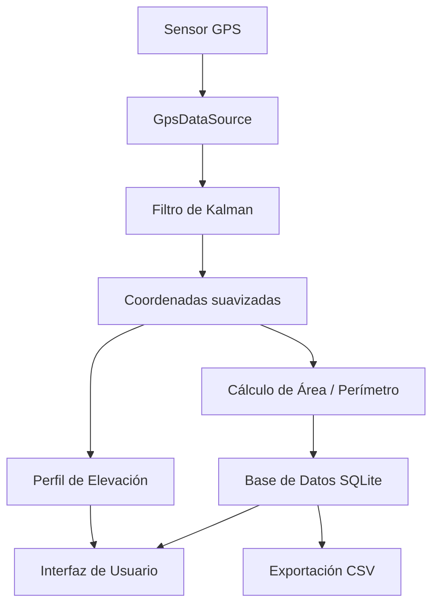
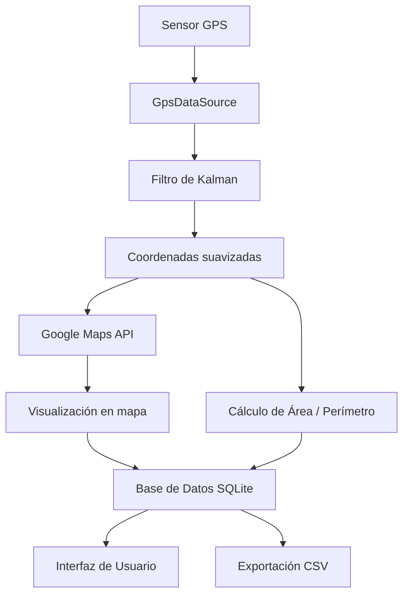

# Documento de Arquitectura — PrediGeo

## 1. Visión General

PrediGeo es una aplicación móvil Flutter que sigue una arquitectura offline-first basada en tres capas principales: **data**, **domain** y **presentation**. La aplicación utiliza Riverpod para la gestión de estado y go_router para la navegación declarativa.

## 2. Capas de la Arquitectura

### 2.1 Capa de Datos (Data)

La capa de datos es responsable de:

- Acceso a la base de datos SQLite mediante DAO (Data Access Objects)
- Implementación de repositorios que abstraen las fuentes de datos
- Captura de datos GPS mediante el sensor del dispositivo
- Almacenamiento y recuperación de mediciones
- Exportación de datos en formato CSV
- Gestión de caché de mapas

**Componentes principales:**

- `GpsDataSource`: Captura coordenadas del sensor GPS
- `MeasurementRepository`: Repositorio de mediciones
- `PointRepository`: Repositorio de puntos GPS
- `DatabaseHelper`: Gestor de la base de datos SQLite
- `CsvExporter`: Exportador de datos en formato CSV

### 2.2 Capa de Dominio (Domain)

La capa de dominio contiene la lógica de negocio de la aplicación:

- Entidades del dominio (Measurement, GpsPoint, Polygon)
- Casos de uso (CapturePoints, CalculateArea, CalculatePerimeter, FilterGpsSignal)
- Modelos de precisión y evaluación
- Interfaces de repositorios (contratos)

**Componentes principales:**

- `Measurement`: Entidad que representa una sesión de medición
- `GpsPoint`: Entidad que representa un punto GPS con latitud, longitud y altitud
- `CalculateAreaUseCase`: Cálculo de área mediante fórmula de Gauss
- `CalculateDistanceUseCase`: Cálculo de distancia mediante fórmula de Haversine
- `KalmanFilter`: Implementación del filtro de Kalman para suavizado GPS
- `AccuracyEvaluator`: Evaluación de precisión (error absoluto, porcentual, RMSE)

### 2.3 Capa de Presentación (Presentation)

La capa de presentación maneja la interfaz de usuario:

- Pantallas (pages) y widgets reutilizables
- Providers de Riverpod para gestión de estado
- Controladores de vista (ViewModels)
- Temas y estilos de la aplicación
- Navegación mediante go_router

**Componentes principales:**

- `HomeScreen`: Pantalla principal con mapa y controles
- `MeasurementScreen`: Pantalla de captura de medición
- `HistoryScreen`: Pantalla de historial de mediciones
- `ElevationProfileScreen`: Pantalla de perfil de elevación
- `SettingsScreen`: Pantalla de configuración
- Providers: `measurementProvider`, `gpsProvider`, `historyProvider`

## 3. Flujo de Datos

### 3.1 Flujo sin conexión (Offline)



### 3.2 Flujo con conexión (Online)



## 4. Patrones de Diseño

### 4.1 Gestión de Estado — Riverpod

La aplicación utiliza Flutter Riverpod como gestor de estado:

- **StateProvider**: Para estados simples y mutables
- **FutureProvider**: Para operaciones asíncronas (consultas a SQLite)
- **StreamProvider**: Para flujos de datos en tiempo real (señal GPS)
- **NotifierProvider**: Para lógica de estado compleja

Ejemplo de estructura de providers:

```dart
final gpsStreamProvider = StreamProvider<GpsPoint>((ref) {
  return ref.watch(gpsDataSourceProvider).gpsStream;
});

final measurementProvider = StateNotifierProvider<MeasurementNotifier, MeasurementState>((ref) {
  return MeasurementNotifier(
    ref.watch(measurementRepositoryProvider),
  );
});

final historyProvider = FutureProvider<List<Measurement>>((ref) async {
  return ref.watch(measurementRepositoryProvider).getAllMeasurements();
});
```

### 4.2 Navegación — go_router

La aplicación utiliza go_router para la navegación declarativa:

- Definición de rutas anidadas
- Redirección basada en estado de autenticación o permisos
- Soporte para deep linking
- Transiciones personalizadas entre pantallas

Ejemplo de configuración de rutas:

```dart
final routerProvider = Provider<GoRouter>((ref) {
  return GoRouter(
    initialLocation: '/',
    routes: [
      GoRoute(path: '/', builder: (context, state) => const HomeScreen()),
      GoRoute(path: '/measurement', builder: (context, state) => const MeasurementScreen()),
      GoRoute(path: '/history', builder: (context, state) => const HistoryScreen()),
      GoRoute(path: '/elevation-profile', builder: (context, state) => const ElevationProfileScreen()),
      GoRoute(path: '/settings', builder: (context, state) => const SettingsScreen()),
    ],
  );
});
```

## 5. Estructura de Directorios

```
lib/
├── main.dart
├── app_theme.dart
├── router.dart
├── core/
│   ├── constants/
│   ├── utils/
│   └── errors/
├── data/
│   ├── datasources/
│   ├── models/
│   └── repositories/
├── domain/
│   ├── entities/
│   ├── repositories/
│   └── usecases/
└── presentation/
    ├── providers/
    ├── screens/
    └── widgets/
```

## 6. Consideraciones de Seguridad y Privacidad

- Los datos GPS se almacenan únicamente en el dispositivo del usuario
- No se transmiten datos a servidores externos sin consentimiento explícito
- Se cumple con la Ley 1581 de 2012 de protección de datos personales
- Se incluye política de privacidad accesible desde la aplicación
- Se permite la eliminación total de datos almacenados
