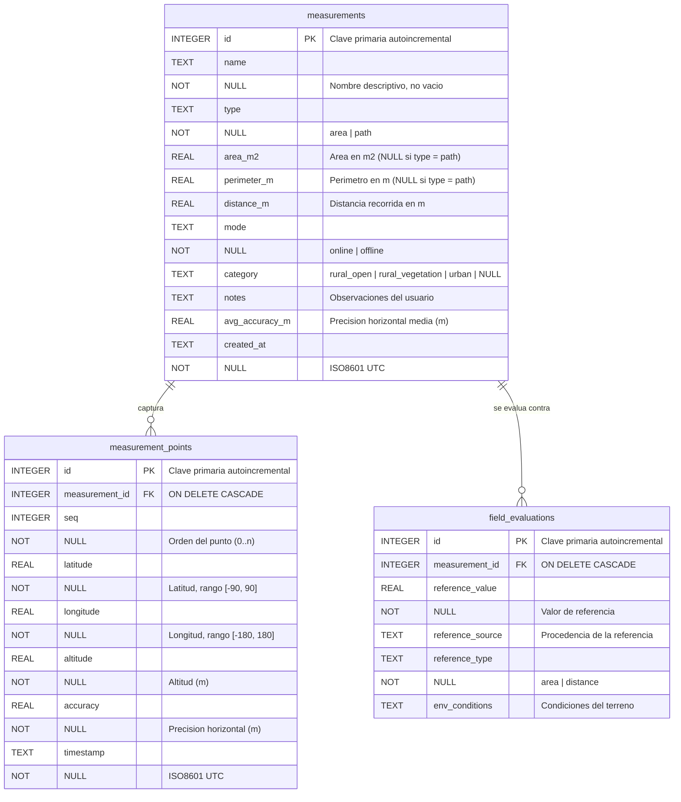

# Modelo de datos local — PrediGeo

Base de datos SQLite (`predigeo.db`), **versión de esquema 2**, con tres tablas
que almacenan la totalidad de la información de forma local. No existe ninguna
dependencia de red: el trabajo con la base de datos ocurre íntegramente en el
dispositivo (arquitectura *offline-first*).

- Implementación: `lib/data/datasources/database_helper.dart` (singleton, `sqflite`)
- Modelos: `lib/data/models/`
- Contrato: `lib/domain/repositories/measurement_repository.dart`
- Implementación: `lib/data/repositories/sqlite_measurement_repository.dart`

## Diagrama entidad-relación



## Índices

| Índice | Tabla | Columnas | Tipo | Propósito |
| --- | --- | --- | --- | --- |
| `idx_measurements_created_at` | `measurements` | `created_at DESC` | normal | Historial siempre ordenado de más reciente a más antiguo. |
| `idx_measurement_points_measurement_seq` | `measurement_points` | `(measurement_id, seq)` | **único** | Cubre las consultas por `measurement_id` (prefijo izquierdo) y garantiza un único punto por posición de la secuencia. |
| `idx_field_evaluations_measurement_id` | `field_evaluations` | `measurement_id` | normal | Consultas de las evaluaciones de una medición. |

Las claves foráneas están activas en cada conexión mediante
`PRAGMA foreign_keys = ON` ejecutado en `onConfigure` (SQLite las tiene
deshabilitadas por defecto). Ambas relaciones usan `ON DELETE CASCADE`, de modo
que no pueden quedar puntos ni evaluaciones huérfanos.

## Descripción de campos

### Tabla `measurements`

Encabezado de una medición de área o de trayecto. Los resultados calculados se
guardan desnormalizados para que el historial se renderice sin recalcular nada.

| Campo | Tipo | Nulo | Descripción |
| --- | --- | --- | --- |
| `id` | INTEGER | no | Clave primaria `AUTOINCREMENT`. |
| `name` | TEXT | no | Nombre de la medición. `CHECK (length(trim(name)) > 0)`. |
| `type` | TEXT | no | `area` (polígono) o `path` (trayecto), con `CHECK IN ('area','path')`. |
| `area_m2` | REAL | sí | Área del polígono en metros cuadrados (fórmula de Gauss / *shoelace*). `NULL` en mediciones de trayecto. `CHECK (area_m2 >= 0)`. |
| `perimeter_m` | REAL | sí | Perímetro del polígono en metros. `NULL` en mediciones de trayecto. `CHECK (perimeter_m >= 0)`. |
| `distance_m` | REAL | sí | Distancia total recorrida (suma de distancias Haversine entre puntos consecutivos). `CHECK (distance_m >= 0)`. |
| `mode` | TEXT | no | `online` (sesión con Google Maps) u `offline` (captura sin conexión), con `CHECK IN ('online','offline')`. Permite comparar la precisión en ambas modalidades. |
| `category` | TEXT | sí | Categoría del terreno: `rural_open`, `rural_vegetation` o `urban`; `NULL` cuando la medición no fue clasificada. Es la variable independiente del experimento de precisión. |
| `notes` | TEXT | sí | Observaciones libres del usuario. |
| `avg_accuracy_m` | REAL | sí | Precisión horizontal media (`accuracy`) de los puntos capturados. Si el usuario no la provee, el repositorio la calcula como el promedio de los puntos. `CHECK (avg_accuracy_m >= 0)`. |
| `created_at` | TEXT | no | Fecha y hora de captura en **ISO8601 UTC** (`2026-03-15T19:30:00.000Z`). Se almacena en UTC y no en hora local para que el orden lexicográfico coincida con el orden cronológico; al leer se convierte a hora local. |

### Tabla `measurement_points`

Puntos GNSS capturados durante la medición, en orden de secuencia. Son la fuente
de verdad para recalcular áreas, distancias y el perfil de relieve.

| Campo | Tipo | Nulo | Descripción |
| --- | --- | --- | --- |
| `id` | INTEGER | no | Clave primaria `AUTOINCREMENT`. |
| `measurement_id` | INTEGER | no | Medición propietaria. `REFERENCES measurements(id) ON DELETE CASCADE ON UPDATE CASCADE`. |
| `seq` | INTEGER | no | Orden del punto dentro de la medición (0, 1, 2, …). En mediciones de área define además el sentido del polígono. `CHECK (seq >= 0)` y único junto a `measurement_id`. |
| `latitude` | REAL | no | Latitud en grados decimales, datum MAGNA-SIRGAS. `CHECK (latitude BETWEEN -90 AND 90)`. |
| `longitude` | REAL | no | Longitud en grados decimales, datum MAGNA-SIRGAS. `CHECK (longitude BETWEEN -180 AND 180)`. |
| `altitude` | REAL | no | Altitud en metros sobre el elipsoide de referencia. Permite construir el perfil de relieve (desnivel y visualisation básica). |
| `accuracy` | REAL | no | Precisión horizontal reportada por el receptor (radio de confianza en metros). `CHECK (accuracy >= 0)`. Es el insumo del filtrado y del promedio de señal. |
| `timestamp` | TEXT | no | Instante del *fix* GNSS en ISO8601 UTC. Permite calcular velocidad de marcha y verificar la duración de la sesión. |

Al insertar una medición, el repositorio **reasigna `seq`** según la posición de
cada punto en la lista, por lo que el orden enviado por la interfaz es siempre el
orden persistido.

### Tabla `field_evaluations`

Valor de referencia conocido del terreno contra el cual se compara el resultado
calculado. Es la base del cálculo de error absoluto, error porcentual y RMSE de la
evaluación de precisión.

| Campo | Tipo | Nulo | Descripción |
| --- | --- | --- | --- |
| `id` | INTEGER | no | Clave primaria `AUTOINCREMENT`. |
| `measurement_id` | INTEGER | no | Medición evaluada. `REFERENCES measurements(id) ON DELETE CASCADE ON UPDATE CASCADE`. |
| `reference_value` | REAL | no | Valor de referencia en m² o en metros, según `reference_type`. |
| `reference_source` | TEXT | sí | Procedencia: agrimensura, plano catastral, punto de control GNSS, entre otros. Permite validar la trazabilidad del dato. |
| `reference_type` | TEXT | no | Magnitud de la referencia: `area` o `distance`, con `CHECK IN ('area','distance')`. |
| `env_conditions` | TEXT | sí | Condiciones de la medición: clima, cobertura vegetal, pendiente, hora, obstrucciones. Explican las diferencias de precisión entre escenarios rurales y urbanos. |

## Reglas de integridad

1. **Transacciones atómicas.** `insertMeasurement` y `update` escriben la
   cabecera, los puntos y las evaluaciones dentro de una única transacción: si
   algo falla, no queda una medición a medias.
2. **Validación en dos niveles.** El repositorio valida nombre y rangos
   geográficos (`ValidationException`) y la base de datos impose restricciones
   `CHECK` como red de seguridad.
3. **Borrado en cascada.** `delete` y `deleteAll` eliminan también los puntos y
   las evaluaciones, sin dejar datos huérfanos.
4. **Inmutabilidad de `created_at`.** Las actualizaciones no modifican la fecha
   de captura, que identifica el momento real de la medición.
5. **Consultas parametrizadas.** Todos los valores viajan por `whereArgs`, lo
   que evita inyecciones SQL. En `search` los comodines `%`, `_` y `\` del término
   se escapan con `ESCAPE '\'`.

## Versionado del esquema

| Versión | Contenido |
| --- | --- |
| 1 | Esquema heredado: `measurements` con `area`, `perimeter`, `distance`, `coordinate_count`, `measurement_type` y `created_at` en epoch; tabla `coordinates`; tabla `measurement_sessions`. |
| 2 | Esquema actual documentado en este archivo. |

La migración `v1 -> v2` se ejecuta en `onUpgrade` y **conserva los datos**:

1. lee las mediciones y coordenadas heredadas en memoria;
2. elimina las tablas heredadas (`coordinates`, `measurement_sessions`,
   `measurements`) y crea el esquema actual con sus índices;
3. reinscribe las mediciones conservando sus `id`, convirtiendo `created_at`
   (epoch) a ISO8601 UTC, `measurement_type` a `type`
   (`polygon`/`area` → `area`, resto → `path`), fijando `mode = 'offline'` y
   calculando `avg_accuracy_m` como el promedio de la precisión de sus puntos;
4. reinscribe los puntos en `measurement_points` renumerando `seq` desde 0
   según el orden de captura heredado (`timestamp` y, a igualdad de tiempo, `id`).

Los puntos huérfanos del esquema heredado (sin `measurement_id` o cuya medición ya
no existe) se descartan, porque el esquema actual no admite filas colgantes.
Todo el proceso se ejecuta dentro de la transacción que sqflite abre para
`onUpgrade`: si algo falla, el esquema anterior queda intacto.

Si se detecta un esquema **más nuevo** que la versión de la aplicación
(`onDowngrade`), el almacenamiento local se reinicia de forma explícita, porque
leer un esquema incompatible produciría datos corruptos.

## Comandos

```bash
# Instalar dependencias (incluye sqflite_common_ffi para las pruebas)
flutter pub get

# Ejecutar todas las pruebas de la capa de persistencia
flutter test

# Solo la capa de datos
flutter test test/data

# Análisis estático y formato
flutter analyze
dart format lib test
```